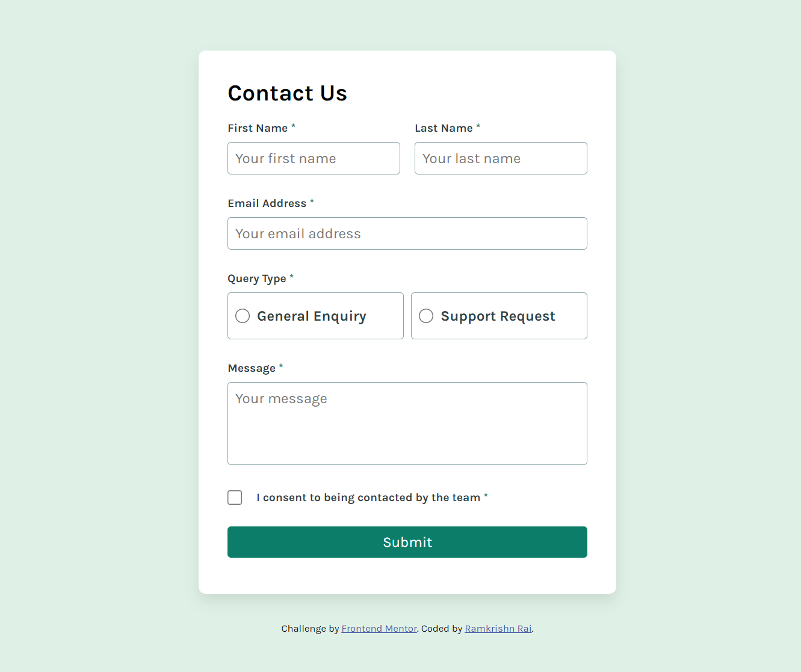

# Frontend Mentor - Contact form solution

This is a solution to the [Contact form challenge on Frontend Mentor](https://www.frontendmentor.io/challenges/contact-form--G-hYlqKJj). Frontend Mentor challenges help you improve your coding skills by building realistic projects.

## Table of contents

- [Overview](#overview)
  - [The challenge](#the-challenge)
  - [Screenshot](#screenshot)
  - [Links](#links)
- [My process](#my-process)
  - [Built with](#built-with)
  - [What I learned](#what-i-learned)
  - [Continued development](#continued-development)
- [Author](#author)

**Note: Delete this note and update the table of contents based on what sections you keep.**

## Overview

### The challenge

Users should be able to:

- Complete the form and see a success toast message upon successful submission
- Receive form validation messages if:
  - A required field has been missed
  - The email address is not formatted correctly
- Complete the form only using their keyboard
- Have inputs, error messages, and the success message announced on their screen reader
- View the optimal layout for the interface depending on their device's screen size
- See hover and focus states for all interactive elements on the page

### Screenshot



### Links

- Solution URL: [Add solution URL here](https://github.com/Ram0O7/contact-form-main)
- Live Site URL: [Add live site URL here](https://ram0o7.github.io/contact-form-main/)

## My process

### Built with

- Semantic HTML5 markup
- CSS custom properties
- Flexbox
- Desktop-first workflow

### What I learned

I learned how to change styling of parent container when a child element is triggered using just css with the help of `:has()` pseudo selector. Also, how i can log the form data to the console using javascript.

```css
.query-type .type:has(input:checked) {
  background-color: var(--green-200);
}
```

```js
// log form data to the console
const formData = new FormData(form);
for (const [key, value] of formData.entries()) {
  console.log(`${key}: ${value}`);
}
```

### Continued development

I would like to learn more about accessibility features and how can i can successfully incorporate them in my projects.

## Author

- Website - [Ramkrishn Rai](https://ramkrishnrai.vercel.app)
- Frontend Mentor - [@Ram0O7](https://www.frontendmentor.io/profile/Ram0O7)
